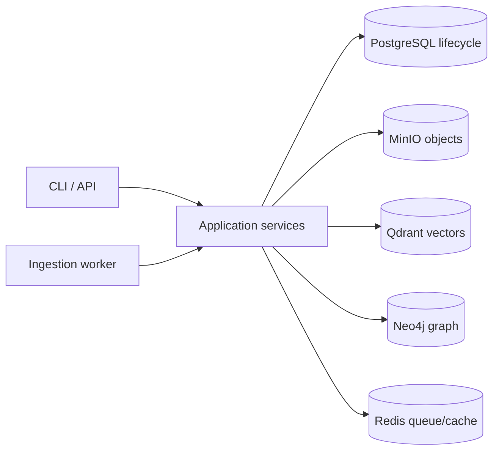
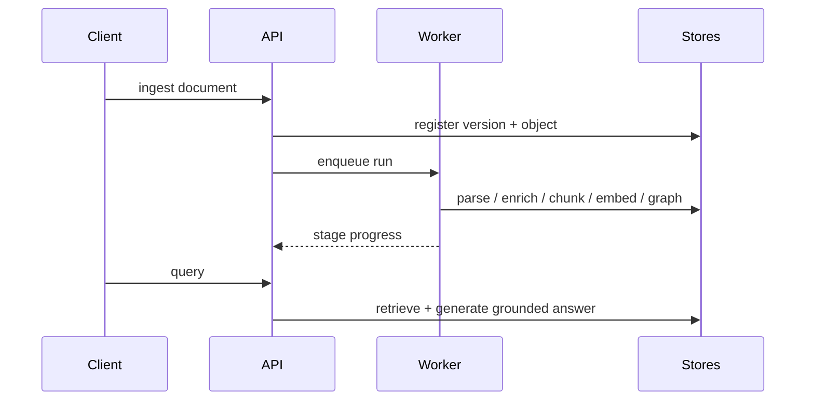

# Architecture

Enterprise RAG-Anything separates parsing, enrichment, indexing and query into explicit adapters over PostgreSQL, MinIO, Qdrant, Neo4j and Redis.

## Ingestion sequence

## Boundaries

- Domain protocols never import provider SDKs.
- Tenant context is required on every store operation.
- Document content is untrusted data inside prompt trust boundaries.
- Shared graph entities are deleted only when orphaned.
